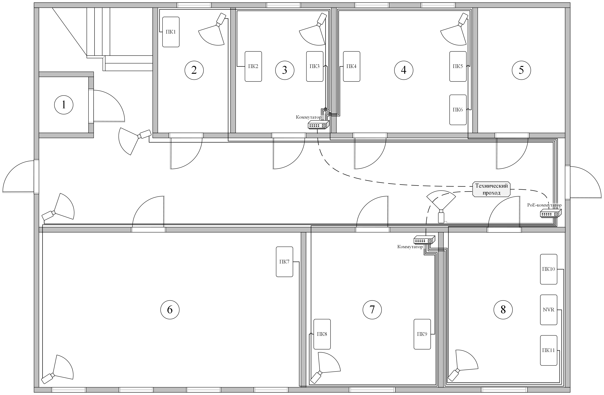
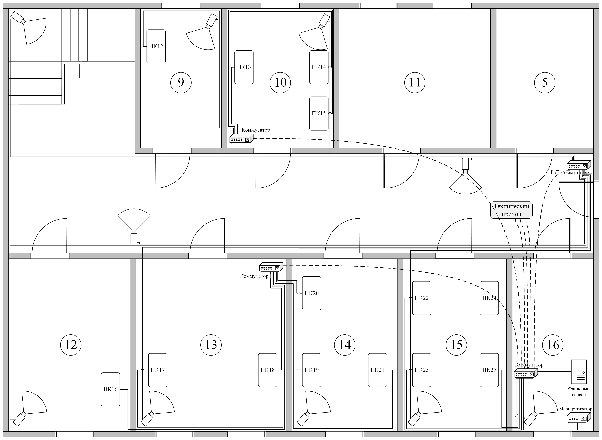
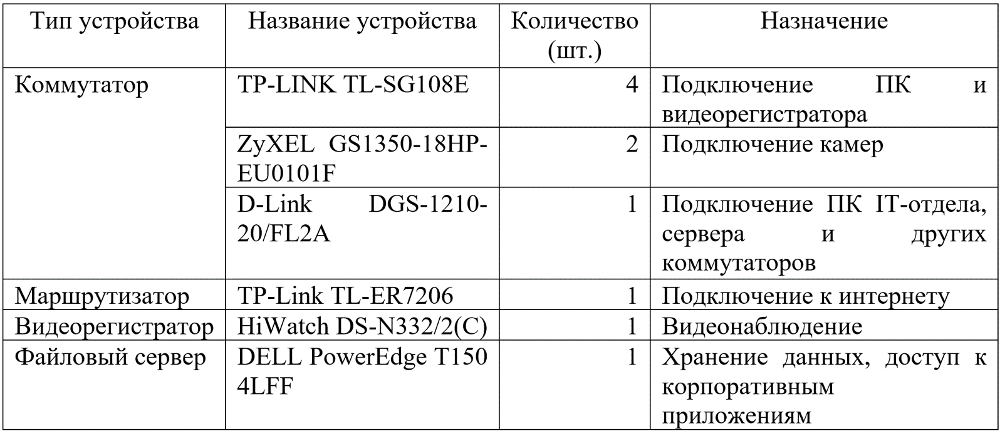
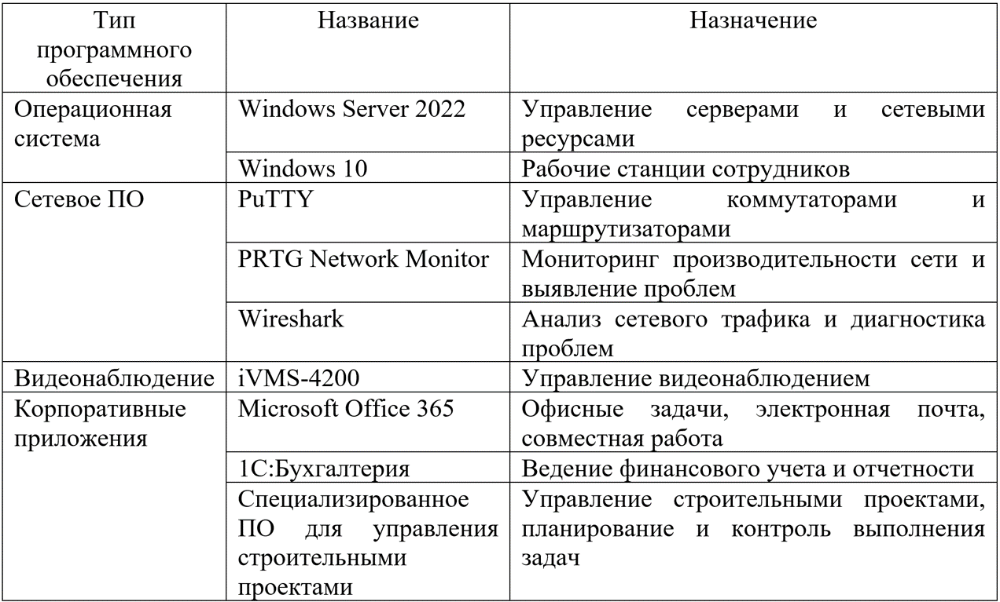

# Инфраструктура предприятия
## Расположение кабельной системы

Всего в организации имеется 53 сетевых устройства, сюда входят: 25 персональных компьютеров, 19 IP-камер видеонаблюдения, 7 коммутаторов, 1 маршрутизатор, 1 файловый сервер и один сетевой видеорегистратор.

На первом этаже всего находится 23 сетевых устройства: из них 3 коммутатора, 11 персональных компьютеров и 9 камер видеонаблюдения. Компьютеры, находящиеся в кабинете сотрудника охраны труда (1 шт.), бухгалтерии (2 шт.) и юридическом отделе (3 шт.) подсоединены к коммутатору, который установлен в бухгалтерии; компьютеры, находящиеся в большой переговорной комнате (1 шт.), отделе кадров (2 шт.) и кабинете охраны (2 шт.) подключены к коммутатору, который установлен в отделе кадров; камеры видеонаблюдения подключены коммутатору, установленному в коридоре возле кабинета охраны. 

Сами коммутаторы подключены к основному коммутатору, который находится в серверной комнате на втором этаже.

На втором этаже всего находится 30 сетевых устройств: из них 4 коммутатора, 1 маршрутизатор, 1 сервер, 1 видеорегистратор, 14 персональных компьютеров и 10 камер видеонаблюдения. Компьютеры, находящиеся в кабинете заместителя генерального директора (1 шт.) и финансово-экономическом отделе (3 шт.), подключены к коммутатору, который установлен в финансово-экономическом отделе; компьютеры, находящиеся в кабинете генерального директора (1 шт.), сметно-договорном отделе (2 шт.) и производственно-техническом отделе (3 шт.), подключены к коммутатору, который установлен в сметно-договорном отделе; камеры видеонаблюдения подключены коммутатору, установленному в коридоре возле серверной комнаты.

Сами коммутаторы подключены к основному коммутатору, который находится в серверной комнате. К основному коммутатору также подключены компьютеры IT-отдела (4 шт.), сервер и маршрутизатор.

## Используемое сетевое оборудование и ПО

