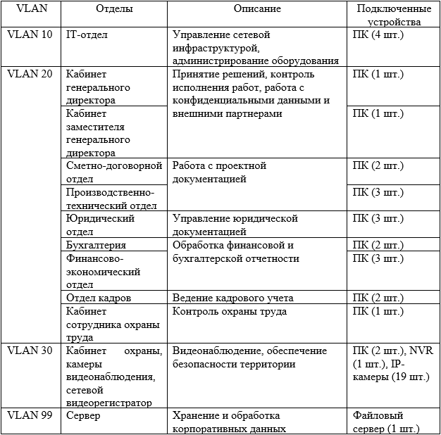
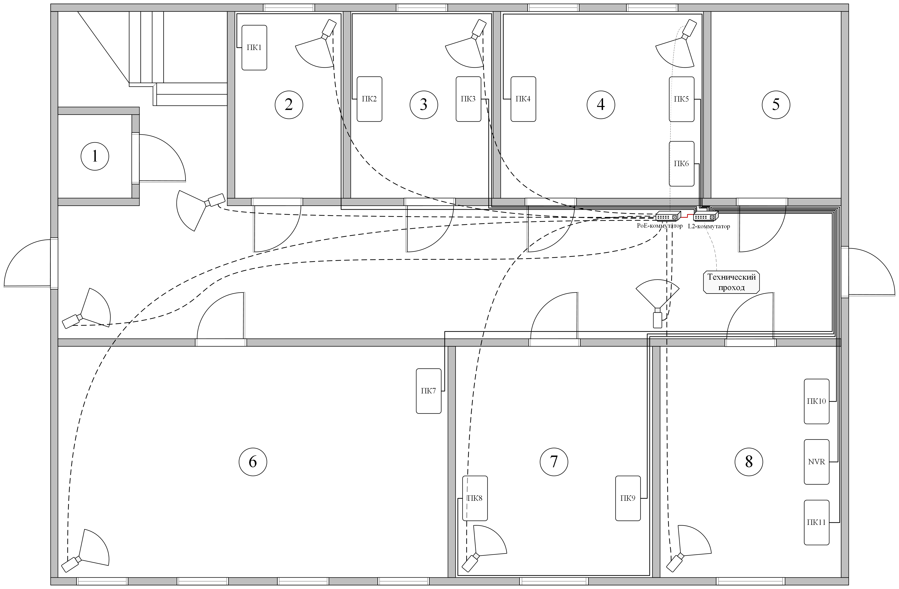
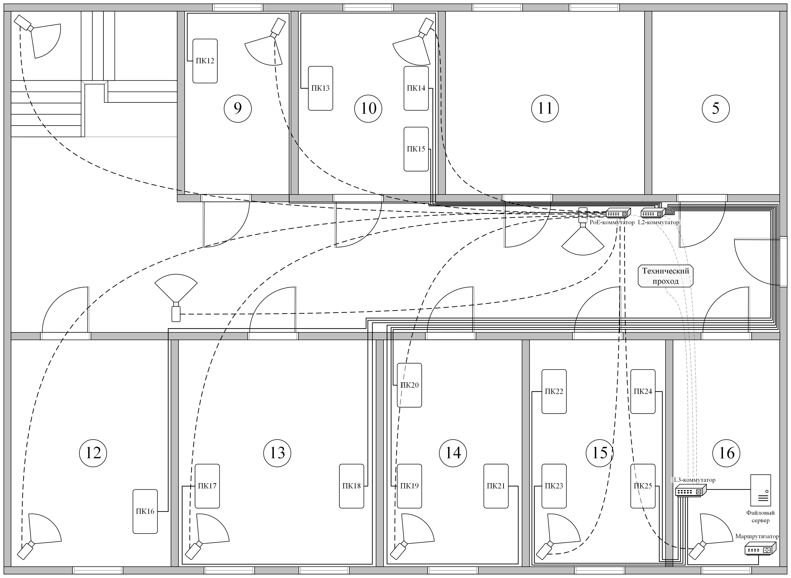

# Практическая часть
## Определение целей

Внедрение VLAN в локальную сеть преследует три основные цели:
1.	Логическое разделение подключенных к сети устройств по отделам (IT-отдел, управление финансами и т.д.)
2.	Повышение безопасности путем ограничения доступа между сегментами.
3.	Оптимизация трафика.

Для достижения поставленных целей существующая сеть была пересмотрена и разделена на 4 логических сегмента, каждый из которых включает в себя один или несколько отделов.

## Расположение кабелей для предлагаемой сети

Для первого этажа предлагается заменить 2 коммутатора, находящихся в бухгалтерии и отделе кадров, на новый L2-коммутатор, который будет располагаться в коридоре вместе со старым PoE-коммутатором в серверном шкафу. К новому L2-коммутатору будут подключены 11 ПК и 1 видеорегистратор, а также PoE-коммутатор первого этажа.

Для второго этажапредлагается заменить 2 коммутатора, находящихся в финансово-экономическом и сметно-договорном отделах, на новый L2-коммутатор, который будет располагаться в коридоре вместе со старым PoE-коммутатором в серверном шкафу. К новому L2-коммутатору будут подключены 10 ПК.

Коммутатор, который находится в серверной, предлагается заменить на новый L3-коммутатор. К L3-коммутатору будут подключены 4 ПК (IT-отдел), 1 файловый сервер, 1 маршрутизатор, L2-коммутаторы первого и второго этажей, а также PoE-коммутатор второго этажа.

