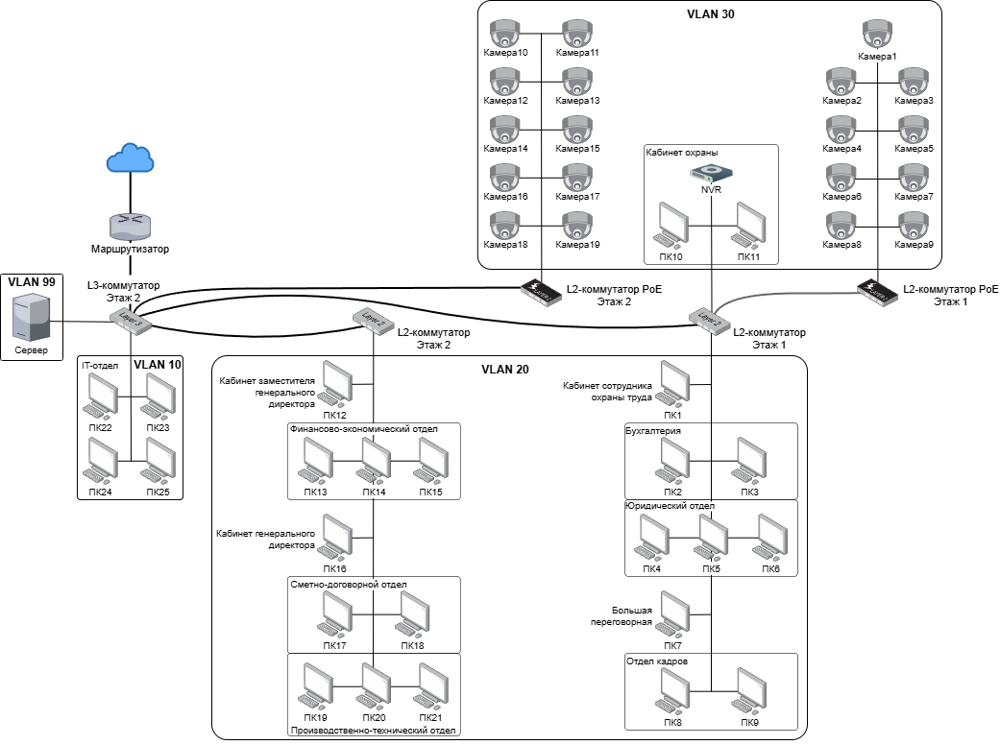

# Практическая часть
## Определение целей

Внедрение VLAN в локальную сеть преследует три основные цели:
1.	Логическое разделение подключенных к сети устройств по отделам (IT-отдел, управление финансами и т.д.)
2.	Повышение безопасности путем ограничения доступа между сегментами.
3.	Оптимизация трафика.

Для достижения поставленных целей существующая сеть была пересмотрена и разделена на 4 логических сегмента, каждый из которых включает в себя один или несколько отделов.

## Расположение кабелей для предлагаемой сети

Для первого этажа предлагается заменить 2 коммутатора, находящихся в бухгалтерии и отделе кадров, на новый L2-коммутатор, который будет располагаться в коридоре вместе со старым PoE-коммутатором в серверном шкафу. К новому L2-коммутатору будут подключены 11 ПК и 1 видеорегистратор, а также PoE-коммутатор первого этажа.

Для второго этажапредлагается заменить 2 коммутатора, находящихся в финансово-экономическом и сметно-договорном отделах, на новый L2-коммутатор, который будет располагаться в коридоре вместе со старым PoE-коммутатором в серверном шкафу. К новому L2-коммутатору будут подключены 10 ПК.

Коммутатор, который находится в серверной, предлагается заменить на новый L3-коммутатор. К L3-коммутатору будут подключены 4 ПК (IT-отдел), 1 файловый сервер, 1 маршрутизатор, L2-коммутаторы первого и второго этажей, а также PoE-коммутатор второго этажа.

**Логическая структура предлагаемой сети с разделением на VLAN**

## Обоснование выбора новой топологии

Изменение топологии существующей сети является целесообразным решением по нескольким причинам:
1)	упрощение структуры локальной сети и снижение количества сетевого оборудования;
2)	повышение удобства масштабирования;
3)	централизация коммутаторов в коридорах;
4)	упрощение администрирования сети;
5)	оптимизация трафика.

Для сравнения текущей и предлагаемой топологий были построены иерархические графы данных сетей, где вершинами являются сетевые устройства, а ребрами — соединения между ними.

**Для текущей сети**

**Для обновленной сети**

Общее число ребер для текущей сети — 53, для предложенной — 51.

Матрица смежности — способ представления графа в виде квадратной матрицы, где строки и столбцы соответствуют вершинам, а элементы матрицы указывают на отсутствие или наличие ребер между ними (0 или 1 соответственно).

В данном случае используется модифицированная матрица смежности, где вместо бинарных значений будет указываться минимальное количество переходов между узлами сети. В качестве вершин будут использованы: сервер (Sr), видеорегистратор (N), ПК (P0 – P4) и камеры (C1 – C2).

**Для текущей сети**

**Для обновленной сети**

Формула для расчета среднего количества переходов между вершинами для сети:

Среднее количество переходов между вершинами в текущей сети для каждого устройства:

Среднее количество переходов между вершинами в предложенной сети для каждого устройства:

Различия в средних значениях обоих сетей минимальны, т.к. в данном случае учитывается взаимодействие всех устройств между собой.

Если рассматривать отдельные сегменты сети, например, первый этаж (в пределах PС1 – PС4) организации, то для текущей сети среднее количество переходов от одного устройства к другому будет составлять 3.3, для текущей – 2.

## Распределение IP-адресов по VLAN

## Топология сети в GNS3

