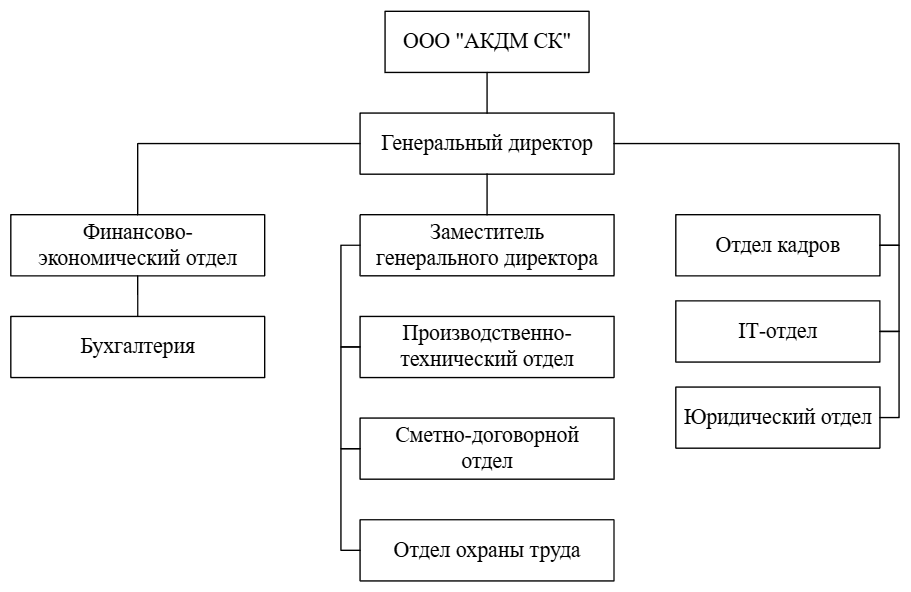
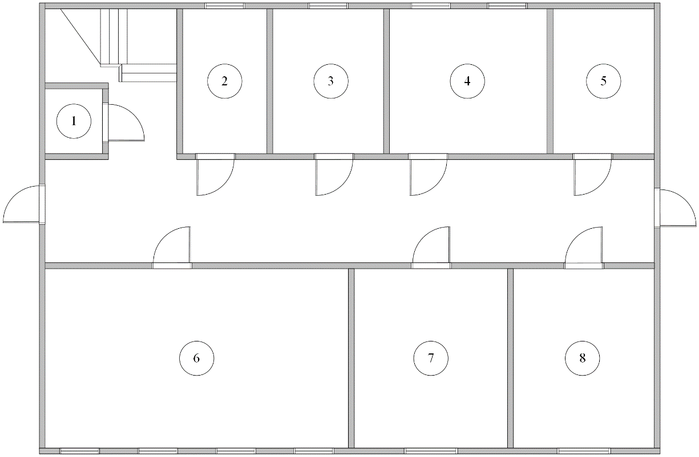
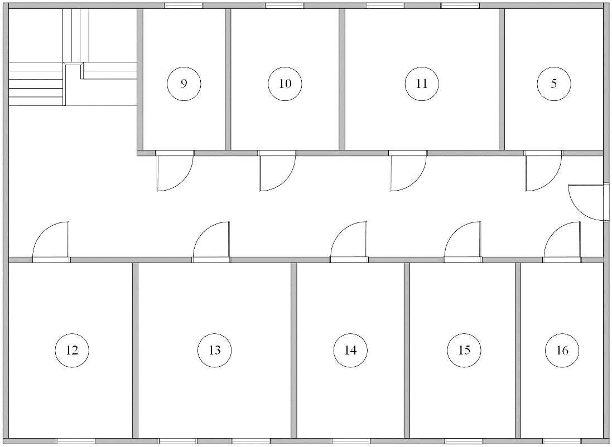

# Анализ предметной области

## Организационная структура

В рамках ВКР рассматривается строительная компания ООО "АКДМ СК". Основной вид деятельности компании — строительство жилых и нежилых зданий (код ОКВЭД 41.20). 
Организация содержит 8 структурных подразделений:
- финансово-экономический отдел;
- бухгалтерия;
- производственно-технический отдел;
- сметно-договорной отдел;
- отдел охраны труда;
- отдел кадров;
- IT-отдел;
- юридический отдел.

## Планировка офиса

Офис компании представляет собой двухэтажное помещение, где каждый этаж организован с учетом функциональных потребностей сотрудников и подразделений.

Первый этаж: 8 помещений — техническое помещение, кабинет сотрудника охраны труда, бухгалтерия, юридический отдел, большая переговорная, отдел кадров, кабинет охраны, санузел.

Второй этаж: 9 помещений — кабинет генерального директора, кабинет заместителя генерального директора, финансово-экономический отдел, сметно-договорной отдел, производственно-технический отдел, IT-отдел, серверная, кухня, санузел.

|Номер помещения|Наименование помещения|
|-|-|
1|Техническое помещение
2|Кабинет сотрудника охраны труда
3|Бухгалтерия
4|Юридический отдел
5|Санузел
6|Большая переговорная
7|Отдел кадров
8|Кабинет охраны
9|Кабинет заместителя генерального директора
10|Финансово-экономический отдел
11|Кухня
12|Кабинет генерального директора
13|Сметно-договорной отдел
14|Производственно-технический отдел
15|IT-отдел
16|Серверная

## 
